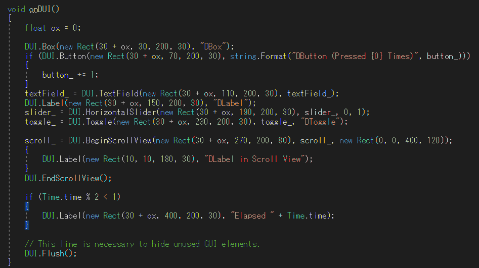

# UnityDUI



## What is This

Unity has two types of UI, IMGUI and uGUI.  
IMGUI is code-based UI API (ex. GUI.Button()).
uGUI is the main GameObject-based UI system. (ex. Unity Editor's main menu > GameObject > UI > Button)

[The Official Manual](https://docs.unity3d.com/2019.4/Documentation/Manual/GUIScriptingGuide.html) says that we should not use IMGUI for in-game UI and should use uGUI instead.  
However, for programmers, IMGUI's code-based interaface is very convienient.
Also, it is very time-consuming and stressfull to place uGUI elements manually.  

Therefore, we implemented **a code-based API to generate uGUI elements like IMGUI.**

For example, if you write the following code,

```
void Update()
{
    DUI.Button(new Rect(30, 30, 200, 50), "Hello DUI");
}
```

a Button GameObject will be created automatically.  
Since the next frame, the above line (`DUI.Button(...)`) will reuse the object.


## How to Use

See **Assets/DUI/Scenes/Demo.cs**

```csharp

void Update()
{
    onDUI();
}

int button_ = 0;
string textField_ = "DTextField";
float slider_ = 0.3f;
bool toggle_ = true;
Vector2 scroll_;

void onDUI()
{
    float ox = 0;

    DUI.Box(new Rect(30 + ox, 30, 200, 30), "DBox");
    if (DUI.Button(new Rect(30 + ox, 70, 200, 30), string.Format("DButton (Pressed {0} Times)", button_)))
    {
        button_ += 1;
    }
    textField_ = DUI.TextField(new Rect(30 + ox, 110, 200, 30), textField_);
    DUI.Label(new Rect(30 + ox, 150, 200, 30), "DLabel");
    slider_ = DUI.HorizontalSlider(new Rect(30 + ox, 190, 200, 30), slider_, 0, 1);
    toggle_ = DUI.Toggle(new Rect(30 + ox, 230, 200, 30), toggle_, "DToggle");

    scroll_ = DUI.BeginScrollView(new Rect(30 + ox, 270, 200, 80), scroll_, new Rect(0, 0, 400, 120));
    {
        DUI.Label(new Rect(10, 10, 180, 30), "DLabel in Scroll View");
    }
    DUI.EndScrollView();

    if (Time.time % 2 < 1)
    {
        DUI.Label(new Rect(30 + ox, 400, 200, 30), "Elapsed " + Time.time);
    }

    // This line is necessary to hide unused GUI elements.
    DUI.Flush();
}
```